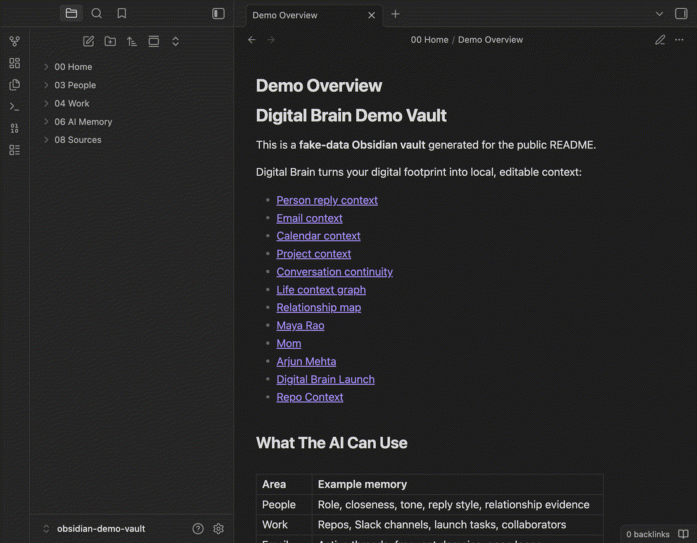
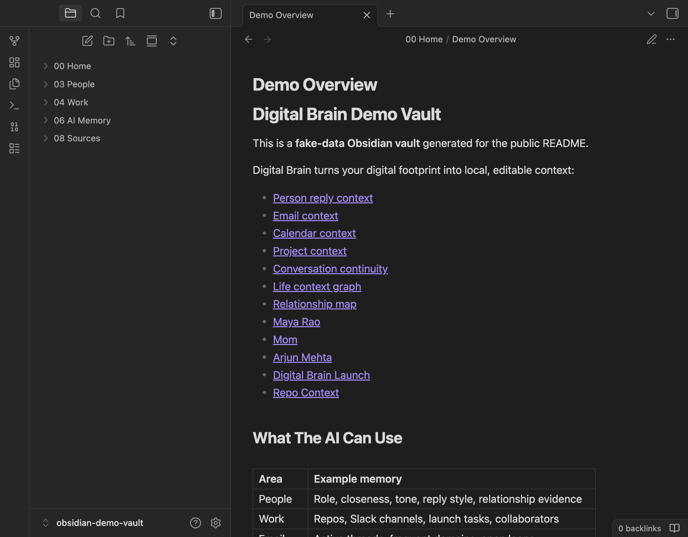
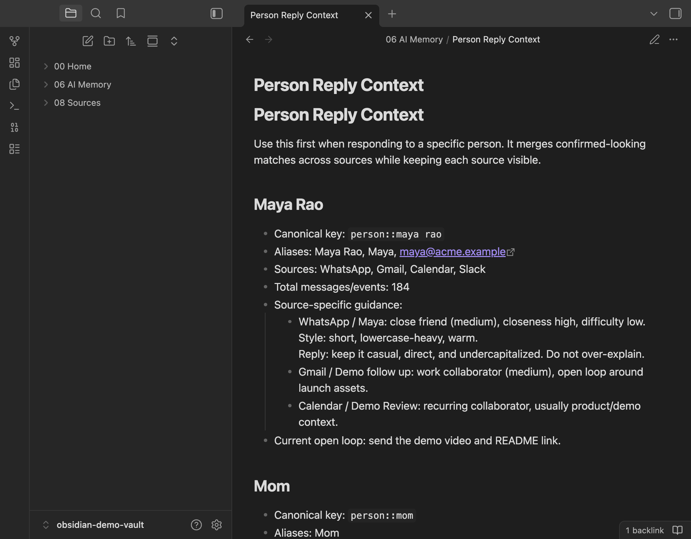
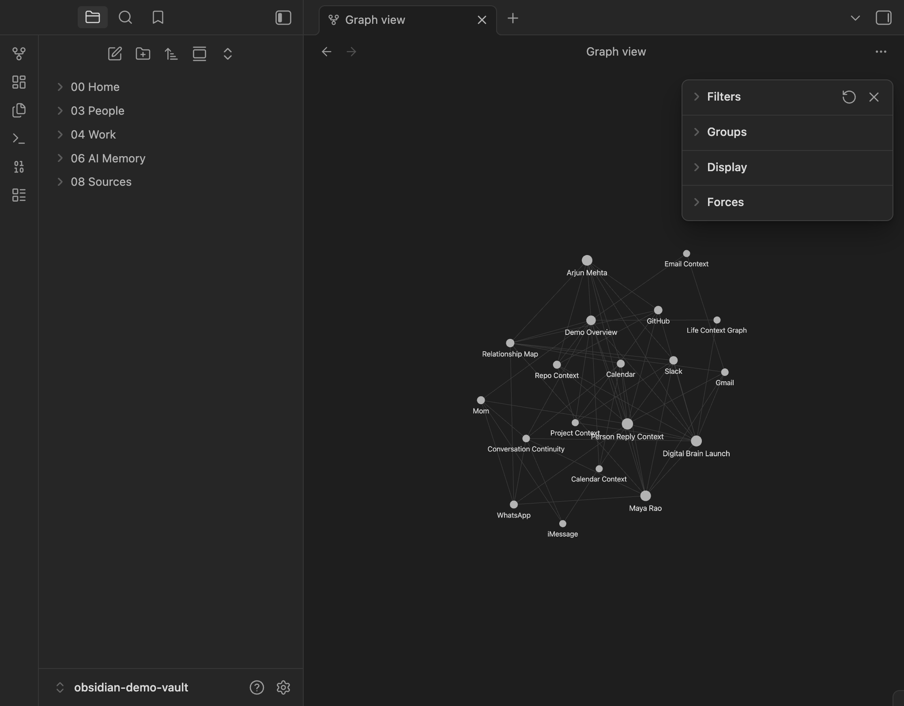
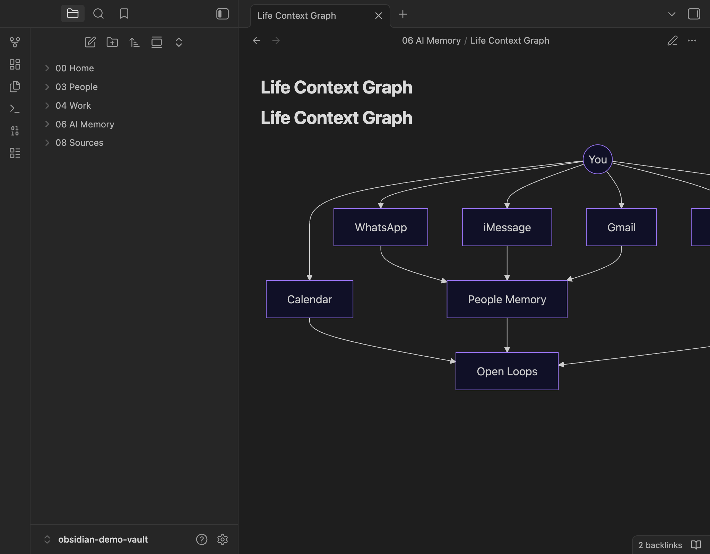
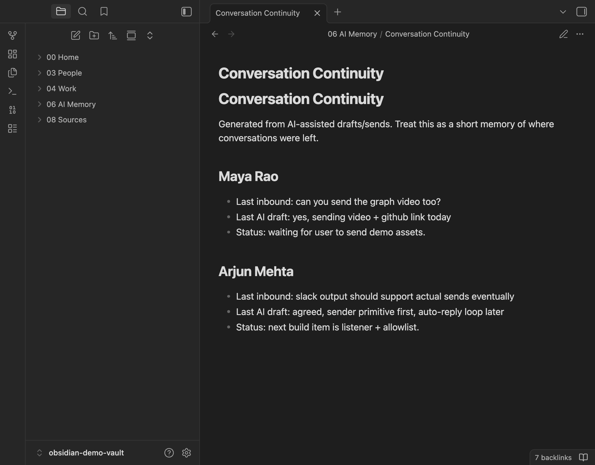

# Digital Brain

[](https://www.npmjs.com/package/digital-brain)
[](https://github.com/rushillshah/digital-brain/actions/workflows/ci.yml)
[](https://github.com/rushillshah/digital-brain/stargazers)
[](LICENSE)

Your life, work, and relationships as a local Obsidian graph that AI can actually use.

Digital Brain turns your local notes and message history into an editable memory vault that AI assistants can use to understand your people, patterns, tone, and context.

It is not a chatbot. It is not a cloud memory service. By default, it writes local files and does not upload your messages.



## Demo

Digital Brain writes a real Obsidian-compatible vault. These screenshots are from a fake-data demo vault opened in Obsidian.

| Obsidian overview | Person memory |
| --- | --- |
|  |  |

| Native Obsidian graph mode | Life graph |
| --- | --- |
|  |  |

| Conversation continuity |
| --- |
|  |

## Why

AI tools are powerful, but they usually start every personal question cold.

Digital Brain gives them a structured, local map of:

- who matters in your life
- how you communicate with different people
- which relationships are warm, operational, difficult, or high-context
- what tone to use when drafting replies
- what not to assume

## Install

```bash
npx digital-brain init
```

The installer asks a short setup quiz: setup mode, history window, primary focus, refresh cadence, always-on interval, active time window, outbound mode, and AI adapter setup.

The quiz is mostly multiple choice. Pick with `A/B/C`, `1/2/3`, the exact value, or press Enter to accept the default. If you skip the vault path, Digital Brain creates a new folder in the current directory:

```text
./Digital Brain Vault
```

For a non-interactive setup:

```bash
npx digital-brain init --yes
```

Inside the quiz, choose `Auto mode` to use recommended always-on local refresh settings. You can also start there directly:

```bash
npx digital-brain init --full-auto
```

Full-auto means local repeated refreshes. It does not mean blind auto-send. WhatsApp sending still defaults to drafts or explicit confirmation, and the AI-disclosure guard stays enabled.

`init` also runs a setup check. npm installs the package dependencies automatically, and Digital Brain does not require pip packages. If Python or a selected source is missing, the check prints the exact next step and setup link. See [docs/SETUP.md](docs/SETUP.md).

For local development:

```bash
npm install
node ./bin/digital-brain.js init ./Digital Brain\ Vault
```

## What It Creates

- An Obsidian-friendly Markdown vault.
- AI adapter files for Codex, Claude, and Gemini.
- WhatsApp Mac import tools.
- Apple iMessage import tools.
- Slack export import tools.
- LinkedIn data archive import tools.
- Gmail Takeout import tools.
- Google Calendar export import tools.
- Relationship extraction and interpretation models.
- Optional WhatsApp Web outbound sender.
- Optional Slack and iMessage outbound senders.
- A refresh script based on your install-time answers.
- An optional always-on watch script that can pull every N minutes.

## What It Can Do

- Import recent WhatsApp history from the local macOS WhatsApp database.
- Import recent iMessage history from the local macOS Messages database.
- Import Slack workspace exports.
- Import LinkedIn data archives for connections and messages when available.
- Import Gmail Takeout `.mbox` exports into email context.
- Import Google Calendar `.ics` exports into schedule/life context.
- Build relationship profiles from message patterns.
- Merge confirmed-looking same-person profiles across sources into a person context index.
- Infer provisional roles like parent, sibling, family group, work collaborator, close personal contact, or unlabeled contact using contact names, message patterns, and explicit conversation evidence.
- Extract relationship-specific typing style: casing, message length, punctuation, emoji, and slang.
- Extract your own outbound communication style so drafts can match your casing, slang, punctuation, lexical patterns, and common phrase shapes.
- Generate "how to continue this relationship" notes.
- Generate reply-ready person context that keeps WhatsApp, iMessage, Slack, and LinkedIn evidence separate under the same person.
- Generate project context from local Git repositories using READMEs, manifests, remotes, and recent commits.
- Create AI-readable memory files for future prompts.
- Draft WhatsApp sends by default, send with explicit `--yes`, or configure auto-send mode during init.
- Run an explicit WhatsApp auto-responder that uses Ollama, OpenAI, Anthropic, xAI, or Codex plus vault memory while the command is running.
- Choose the WhatsApp auto-reply provider during init: Ollama, OpenAI API, Anthropic API, xAI API, Codex app bridge, or Codex CLI.
- Choose reply style during init: match your learned chat style, allow light casual imperfections, or keep replies clean/formal.
- Enforce an AI-disclosure guard after repeated AI-assisted sends.

## Core Commands

```bash
digital-brain init
digital-brain run
digital-brain demo-proof --out ./demo-assets
digital-brain showcase --out ./demo-assets
digital-brain doctor
digital-brain sync-imessage --days 30
digital-brain import-slack --input ./slack-export.zip
digital-brain import-linkedin --input ./linkedin-archive.zip
digital-brain import-gmail --input ./takeout.mbox
digital-brain import-calendar --input ./calendar.ics
digital-brain import-repos --input ./codewiser-frontend --input ./codewiser-backend
digital-brain connect-repos
digital-brain send-whatsapp --to "Name" --message "text"
digital-brain send-slack --channel C123 --message "text"
digital-brain send-imessage --to "+15551234567" --message "text"
digital-brain auto-whatsapp --allow "Name" --model llama3.1
digital-brain auto-whatsapp --contact "+15551234567" --model llama3.1
digital-brain auto-whatsapp --allow "Name" --shared-group-context-days 14
OPENAI_API_KEY="sk-..." digital-brain auto-whatsapp --allow-all --provider openai --model gpt-4.1-mini --yes
ANTHROPIC_API_KEY="sk-ant-..." digital-brain auto-whatsapp --allow-all --provider anthropic --yes
XAI_API_KEY="xai-..." digital-brain auto-whatsapp --allow-all --provider xai --yes
digital-brain auto-whatsapp --allow-all --provider codex --yes
digital-brain auto-whatsapp --allow-all --provider codex-app --yes
digital-brain pause-whatsapp
digital-brain resume-whatsapp --chat "Name"
```

While `auto-whatsapp` is running in a focused terminal, press `Space` to pause/resume globally.

`init` remembers your vault globally, so `run` works from anywhere. `run` syncs the live local sources you selected, extracts relationships, and writes interpreted memory in one command.

Slack and LinkedIn are import-based. Digital Brain reads official export archives; it does not scrape LinkedIn or automate private app UIs. See [docs/INTEGRATIONS.md](docs/INTEGRATIONS.md).

Repository context is local-first too. During `init`, choose `Git repositories`, then `Connect GitHub` to use the GitHub CLI auth flow, pick allowed repos, and clone/pull them into `~/.digital-brain/github-repos`. You can also skip GitHub and use local paths. `import-repos` reads high-level repo artifacts, not full source dumps, and writes `06 AI Memory/Project Context.md` plus per-repo notes under `08 Sources/Repositories`.

You can add repository context later with `digital-brain connect-repos`; it updates the vault config and imports the selected repos. Auto-reply also maintains `06 AI Memory/Conversation Continuity.md` after AI-assisted drafts/sends so future replies know where each conversation was left off.

Use `digital-brain doctor` or `digital-brain tutorial` anytime to see dependency status and next steps.

Use `digital-brain showcase --out ./demo-assets` to generate a fake-data sample vault and launch copy for README/social posts. See [docs/GROWTH.md](docs/GROWTH.md) and [docs/LAUNCH_KIT.md](docs/LAUNCH_KIT.md).

The lower-level commands still exist for debugging:

```bash
digital-brain sync-whatsapp
digital-brain sync-imessage
digital-brain extract
digital-brain interpret
```

The sender drafts by default. Add `--yes` to actually send.

The auto-responder is opt-in and runs only while the command is active. On startup it scans unread WhatsApp Web chats, then listens for new messages. It requires an allowlist unless you explicitly pass `--allow-all`. Without `--yes`, it only logs drafts unless you selected `Auto-send while running` during init:

```bash
digital-brain auto-whatsapp --allow "Mom" --model llama3.1
digital-brain auto-whatsapp --allow "Mom" --model llama3.1 --yes
digital-brain auto-whatsapp --allow "Mom" --model llama3.1 --yes --no-process-unread
digital-brain auto-whatsapp --allow "Mom" --reply-style-mode casual-imperfect --yes
digital-brain auto-whatsapp --allow "Mom" --shared-group-context-days 14 --yes
digital-brain auto-whatsapp --contact "+15551234567" --model llama3.1 --yes
OPENAI_API_KEY="sk-..." digital-brain auto-whatsapp --allow-all --provider openai --model gpt-4.1-mini --yes
ANTHROPIC_API_KEY="sk-ant-..." digital-brain auto-whatsapp --allow-all --provider anthropic --yes
XAI_API_KEY="xai-..." digital-brain auto-whatsapp --allow-all --provider xai --yes
digital-brain auto-whatsapp --allow-all --provider codex --yes
digital-brain auto-whatsapp --allow-all --provider codex-app --yes
```

If you start without `--allow`, `--contact`, or `--allow-all` in an interactive terminal, Digital Brain asks whether to cover all contacts or select contacts from your WhatsApp chat list. With `--allow-all`, it still asks once before the first AI reply to each new chat and stores the decision in `08 Sources/WhatsApp/Outbound/auto-reply-whitelist.json`. Use `--auto-approve-new-chats` only if you intentionally want unattended first sends.

Even with `--allow-all`, likely business, notification, OTP, delivery, bank, and support chats are skipped by default. Use explicit `--allow "Name"` or `--contact "+15551234567"` for trusted personal chats. Pass `--include-businesses` only if you intentionally want those chats included.

Auto-reply also includes bounded shared group context by default. When replying to a direct chat, it scans recent WhatsApp raw records for group chats where that person appears as a participant and adds short nearby snippets to the prompt. This helps preserve intent when a direct message continues something discussed in a group. Tune it with `--shared-group-context-days 14`, `--max-shared-group-context-chars 3000`, or disable it with `--no-shared-group-context`.

The default provider is local Ollama. `--provider openai`, `--provider anthropic`, and `--provider xai` use hosted APIs with the same vault context prompt. Defaults are `gpt-4.1-mini`, `claude-sonnet-4-6`, and `grok-4.3`. `--provider codex` uses the Codex CLI. `--provider codex-app` uses a file bridge for the Codex desktop app.

`--reply-style-mode` controls how polished the AI replies should be. Use `match-user` to follow learned chat style, `casual-imperfect` to allow light lowercase/shorthand/small natural imperfections, or `clean-formal` for cleaner spelling and punctuation.

```bash
OPENAI_API_KEY="sk-..." digital-brain auto-whatsapp --allow-all --provider openai --model gpt-4.1-mini --yes
ANTHROPIC_API_KEY="sk-ant-..." digital-brain auto-whatsapp --allow-all --provider anthropic --yes
XAI_API_KEY="xai-..." digital-brain auto-whatsapp --allow-all --provider xai --yes
```

If you select `OpenAI API`, `Anthropic API`, or `xAI API` during `digital-brain init`, you can either paste an API key to store it in the local vault config or leave it blank and set `OPENAI_API_KEY`, `ANTHROPIC_API_KEY`, or `XAI_API_KEY` before running `auto-whatsapp`.

```bash
digital-brain auto-whatsapp --allow-all --provider codex --yes
```

If your Codex CLI needs a custom command, pass `--codex-command "..."` or set `DIGITAL_BRAIN_CODEX_COMMAND`. If the command contains `{promptFile}`, Digital Brain writes the reply prompt to a temp file and substitutes that path; otherwise it pipes the prompt to stdin.

For the Codex desktop app bridge:

```bash
digital-brain auto-whatsapp --allow-all --provider codex-app --yes
```

Digital Brain writes requests to `08 Sources/WhatsApp/Outbound/Codex App Bridge/requests` and waits for matching JSON responses in `responses`.

If you select `Codex app bridge` during `digital-brain init`, the vault also gets `Tools/Codex App Bridge Automation.md` with the exact prompt to use in the Codex app.

If Digital Brain has already sent two AI-assisted messages to the same chat in the last 24 hours, the next send must disclose that AI is helping. Once that chat has received an AI disclosure, Digital Brain will not keep repeating it.

## Automation

Each vault gets:

```bash
Tools/digital-brain-refresh.sh
```

For 24/7 local polling:

```bash
Tools/digital-brain-watch.sh
```

Use these with Codex automations, local cron, launchd, or another scheduler. See [docs/AUTOMATIONS.md](docs/AUTOMATIONS.md).

## Example

Before Digital Brain:

> Help me reply to my mom.

Generic AI gives generic advice.

After Digital Brain:

> Help me reply to my mom.

Your AI can use local context: this person is your mother, the tone should be warm, the thread may be logistical, and the reply should not sound like a work update.

More examples are in [docs/EXAMPLES.md](docs/EXAMPLES.md).

## Known Limitations

- This is alpha software and source integrations can break when local app schemas or web sessions change.
- Relationship roles and same-person matches are provisional working notes, not truth.
- WhatsApp and iMessage local database access is macOS-specific and permission-sensitive.
- Slack, LinkedIn, Gmail, and Calendar are import/export based unless otherwise documented.
- Outbound messaging is powerful and risky; keep allowlists narrow and test draft mode first.
- Hosted AI providers send prompt context to that provider when selected. Local-first does not mean every optional provider is local.

## Try Fake Data

```bash
npm run test:sample
digital-brain showcase --out ./demo-assets
```

This uses fake WhatsApp-style messages in `examples/sample-vault`.

## Contributing

PRs are welcome, but this project is privacy-sensitive. Read [CONTRIBUTING.md](CONTRIBUTING.md) before opening a PR, especially if touching imports, generated memory, provider prompts, logs, or outbound messaging.

Growth and contributor tooling is documented in [docs/GROWTH.md](docs/GROWTH.md). Starter tasks are in [docs/GOOD_FIRST_ISSUES.md](docs/GOOD_FIRST_ISSUES.md). Do not fake npm downloads, stars, or installs.

## Privacy

Digital Brain is local-first. It does not upload messages or notes.

WhatsApp support reads the local macOS WhatsApp database when available. This is experimental and unofficial. Outbound messaging uses WhatsApp Web through `whatsapp-web.js`.

Apple iMessage support reads the local macOS Messages `chat.db` when available. If the database is missing or inaccessible and iMessage was selected, `digital-brain run` fails with a clear setup error instead of silently skipping it.

Slack support reads Slack workspace export JSON. LinkedIn support reads LinkedIn data archive CSV files when LinkedIn includes the relevant files in your archive.

Relationship labels are working notes, not truth. You can edit them with `relationship_overrides.json`.
Role inference records evidence snippets from conversation text when available, but labels are still provisional and should be corrected with overrides where wrong.

Anonymous telemetry is off by default and opt-in during setup. Opt-in events are recorded locally and only sent over the network if `DIGITAL_BRAIN_TELEMETRY_URL` is set. Telemetry may include setup success/failure metadata only: event name, version, platform, selected sources, and error step/status. It must never send messages, names, vault paths, API keys, raw exports, or generated memory.

Always-on and outbound modes depend on local app databases, WhatsApp Web, and third-party behavior that can change. You are responsible for consent, privacy, message content, and anything sent from your machine.

## Status

Alpha. Expect rough edges.

Do not use this for regulated, emergency, legal, medical, or safety-critical communication.
